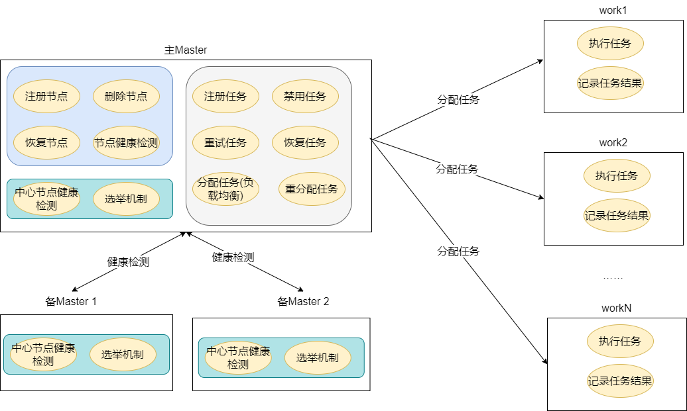
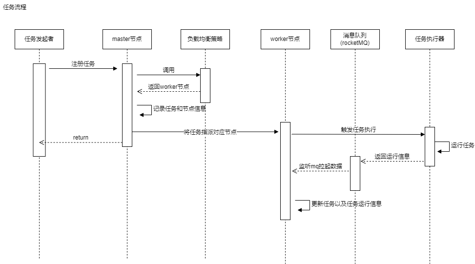

# easy-job整体架构
easy-job是一个分布式任务执行器，分为中心节点master和执行节点work。

### 中心节点功能应包含：

对work节点：
+ 注册work节点
+ 删除work节点
+ 恢复work节点
+ work节点心跳检测

对task管理：

+ 注册task
+ 禁用task
+ 重试task
+ 恢复task
+ 负载均衡分配work处理task
+ 重分配work处理task


同时自身需要做到高可用:
+ 中心节点之间心跳检测
+ 中心节点的主节点选举机制


### work节点功能应包含:
+ task调用
+ task运行结果记录
+ 通知master节点已完成task信息


### 其他
+ id生成器：
+ disable节点时，如果有task还在执行中，master通过负载均衡器不能再往该节点分配task；同时在运行中的任务结束前该节点依然可以用来接收任务执行结果
+ disable任务时，如果有task还在执行中，需要更加具体场景来确定是立即停止任务或者是运行任务运行完成

针对可能出现的系统异常需考虑：
+ task开始运行但未返回结果，work节点出故障； 解决方案：需要通知master节点，重新分配新work

整体功能架构如下图所示



## 整体技术概要架构
主要流程图：



中间件及持久层使用:
+ nacos
  作为配置中心，存储各worker节点元信息以及master节点元信息
+ redis
  作为负载均衡策略的信息保存空间，用于记录各worker节点分配到一次性任务以及循环任务的信息
+ rocketMq
  执行结果的回调信息存放地址，设置超时告警时间，如果某条记录长时间为消费，说明该任务对应的调度worker节点出现异常，需要master节点接入处理


注： 因时间关系，简化大量原定设计
+ 负载均衡使用最简单的随机策略
+ 重分配work节点已最简单的轮询策略
+ work节点心跳检测代码未完成
+ master自身高可用代码未完成
+ 业务id生成器不在本设计里，以最简单方式实现
+ trace_id由具体任务生成，本次使用最简单方式实现
+ nacos存储信息直接放到mysql中


工程结构：
+ easy-job-core
  核心持久化数据的crud以及部分业务逻辑和策略（例如负载均衡、状态转换）
+ easy-job-manage
  对外暴露服务，包括master节点管理、node节点管理、任务注册等controller接口
+ easy-job-client
  任务执行器

## 持久层
### 数据库表设计

表设计中必备的create_at,update_at，create_by,update_by这些必备字段未特别列入，默认已包含
1.  Group表：分组基本信息


| 字段 | 字段类型 | 字段说明 | 备注 |
| --- | --- | --- | --- |
|id|bigint|主键id|自增,用于作为mysql的主键，不作为业务使用id|
|group_id|bigint|业务唯一id|unique,使用id生成器生成的唯一id,作为业务id使用|
|group_name|varchar|分组名|

2.  Work表：保存work节点的元信息

| 字段 | 字段类型 | 字段说明 | 备注 |
| --- | --- | --- | --- |
|id|bigint|主键id|自增,用于作为mysql的主键，不作为业务使用id|
|work_id|bigint|业务唯一id|unique,使用id生成器生成的唯一id,作为业务id使用|
|ip|varchar|节点端口号|not null|
|port|int|服务端口|not null|
|name|varchar|节点名|not null|
|group_id|bigint|所属分组|关联group表中的groupId
|disable|int|节点是否禁用|0为否，1为是, not null|


3. Task表：任务元信息

| 字段 | 字段类型 | 字段说明 | 备注 |
| --- | --- | --- | --- |
|id|bigint|主键id|自增,用于作为mysql的主键，不作为业务使用id|
|task_id|bigint|业务id|unique,使用id生成器生成的唯一id,作为业务id使用|
|bean_name|varchar|bean名||
|name|varchar|任务名|not null|
|group_id|bigint|任务所属分组|关联group表中的groupId
|disable|int|任务是否禁用|0为否，1为是, not null|针对interval为0的任务，运行完一次后disable设为1|
|interval|int|执行间隔时间|单位为ms,0表示不会间隔执行|
|retry|int|任务是否重试|0为否，1为是，not null|

4. Task_log表：任务运行日志表


| 字段 | 字段类型 | 字段说明 | 备注 |
| --- | --- | --- | --- |
|id|bigint|主键id|自增,用于作为mysql的主键，不作为业务使用id|
|log_id|bigint|业务id|unique,使用id生成器生成的唯一id,作为业务id使用|
|task_id|bigint|运行任务对应的id||
|task_start_time|date|任务开始时间||
|task_end_time|date|任务结束时间||
|task_status|bigint|运行任务对应的id||
|task_work_id|bigint|任务运行的节点信息||
|trace_id|varchar|全链路唯一id|用于在日志中心排查问题的唯一id|


## 中心节点master
```java

    /**
     * 新增一个work节点
     * @param work
     * @return
     */
    Work register(Work work);

    /**
     * 禁用work节点
     * @param workId
     * @return
     */
    void disable(Long workId);

    /**
     * 恢复work节点
     * @param workId
     * @return
     */
    void enable(Long id);

    /**
     * 新增一个任务
     * @param task
     * @return
     */
    Task register(Task task);

    /**
     * 禁用,相当于删除效果
     * @param taskId
     * @return
     */
    void disable(Long taskId);

    /**
     * 手动重试,手动执行
     * @param taskId
     * @return
     */
    void retry(Long taskId);
```

##执行节点node
拉取任务
```java
com.easy.job.client.EasyJobExecutor.TaskLoader
```

执行任务
```java
com.easy.job.client.EasyJobExecutor.Worker
```